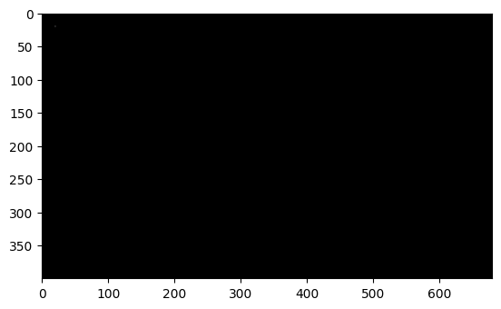
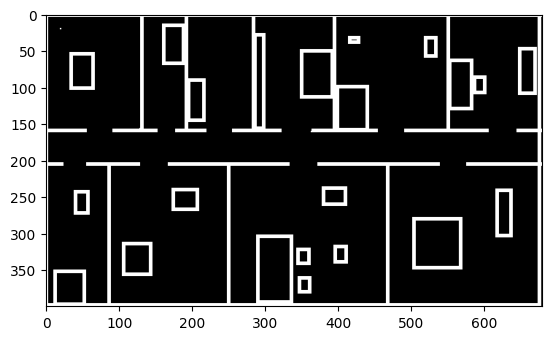
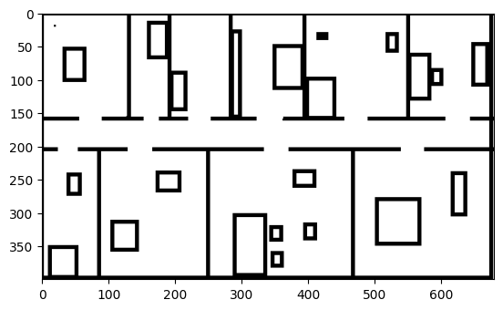
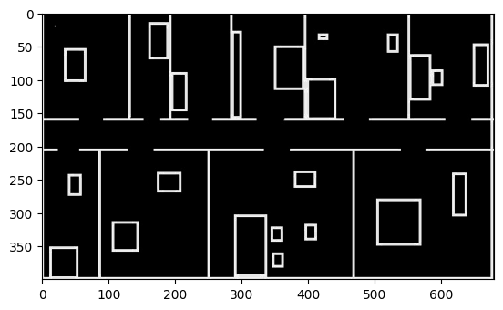
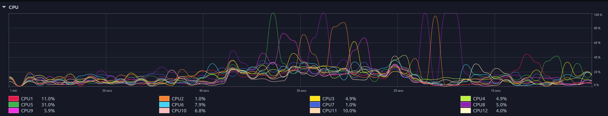

# Beam-Sensor-Model
This is a quick and simple implementation of a beam sensor model. The beam sensor model is a simple model for simulating laser scanners. It is based on the [sensor model](http://wiki.ros.org/sensor_model) package, but uses a beam model instead of a ray model. The beam model is more suitable for simulating laser scanners, which are often used in robotics.
>> The results are saved in the `results` folder.
## Part 1: Beam Readings for a certain pose
**Static**

**Dynamic**


>> to get these results, run the following command:
>> ```bash
>> python3 beam_sensor_model.py
>> ```

## Part 3: Estimating the pose of the robot based on the beam readings

**Robots pose = (20, 20, 0)**

**More clear images after applying erosion and dilation**


**Final likelihood with the map**


**For the pose estimation, a multi-threaded code was used**


